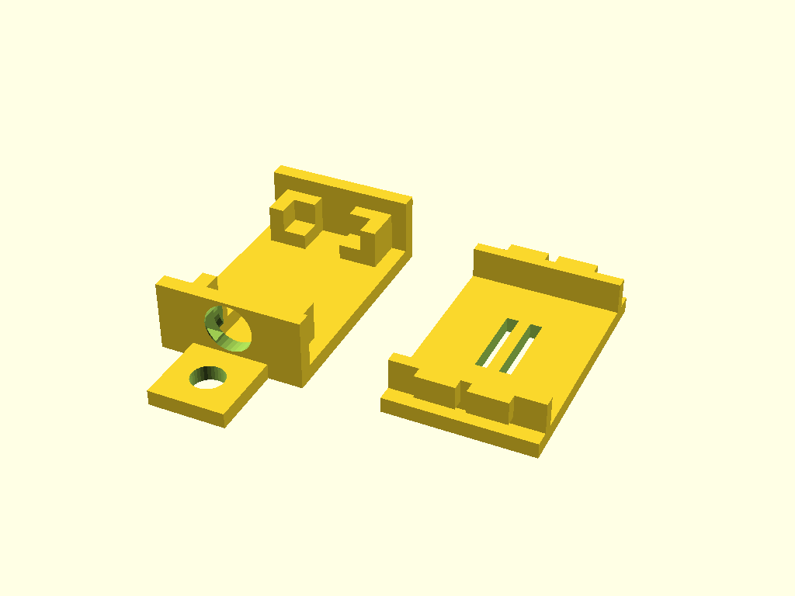
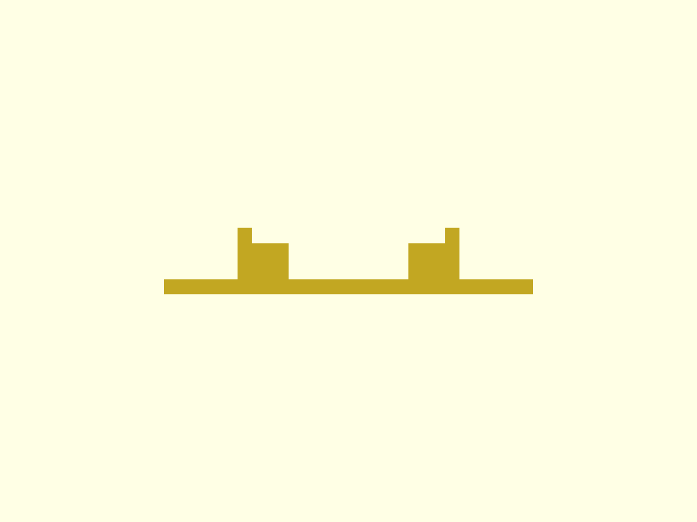
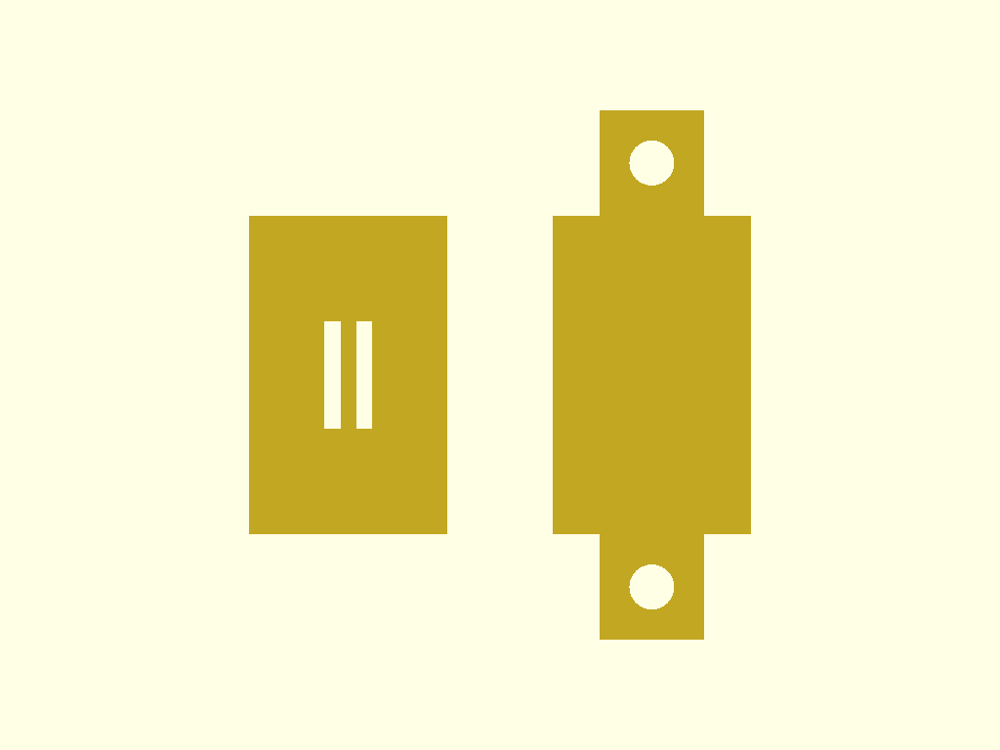

# BoxGen Skills

Claude Code skills for generating 3D-printable electronics enclosures. Give it your PCB dimensions and get a parametric [OpenSCAD](https://openscad.org/) enclosure — ready for printing.

Answer 7 questions about your device and the skill pipeline generates a complete enclosure — `.scad` source + `.stl` + preview images.



## Quick Start

```bash
git clone https://github.com/huseyintamer/opencad-print.git
claude --plugin-dir ./opencad-print
```

Then type:

```
/opencad-print:enclosure-params
```

That's it. Answer 7 questions and the pipeline generates your enclosure automatically.

## How It Works

The plugin runs 3 skills in sequence — each one chains to the next automatically:

```
 /enclosure-params       You answer 7 questions about your device
        │                (dimensions, open faces, ventilation, mounting, extras)
        ▼
  enclosure-spec.json    Parameters saved as JSON
        │
        ▼
 /enclosure-generate     AI writes parametric OpenSCAD code from scratch
        │                (uses templates + manufacturing constraints)
        ▼
  enclosure.scad         Full .scad source file
        │
        ▼
 /enclosure-validate     OpenSCAD CLI validates + exports
        │                (auto-fixes errors, up to 5 iterations)
        ▼
  enclosure.stl          Print-ready STL
  enclosure-*.png        4 preview images (iso, front, top, side)
```

You only run `/enclosure-params` — the rest happens automatically.

## Example

This repo includes a generated example: an enclosure for a small electronics board (18 × 25.5 × 3.1 mm).

**Input parameters** (`enclosure-spec.json`):

```json
{
  "type": "tray-lid",
  "device": { "length": 18.0, "width": 25.5, "height": 3.1 },
  "wall_thickness": 2,
  "tolerance": 0.5,
  "mounting": "corner-supports",
  "open_faces": ["front", "back"],
  "ventilation": { "enabled": true, "position": "top" },
  "extras": {
    "cable_hole": { "enabled": true, "diameter": 6, "face": "left" },
    "mounting_ear": { "enabled": true, "hole_diameter": 4, "ear_width": 10 }
  }
}
```

**Generated output** — tray (left) and lid (right) in print layout:

| Isometric | Top | Front | Side |
|-----------|-----|-------|------|
|  |  |  |  |

**What you get:**
- Snap-fit tray + lid (no screws needed)
- Open front and back faces for connectors
- Corner supports hold the PCB in place
- Top ventilation grille for cooling
- Cable hole on the left wall
- Mounting ears with screw holes on both sides

## Features

- **Interactive Q&A** — guided parameter collection with smart defaults
- **Parametric OpenSCAD** — all dimensions as variables, easy to tweak
- **Snap-fit lid** — clip-on, no screws needed
- **Multiple mounting options** — corner supports, standoffs, edge rails, or none
- **Ventilation** — top grille or side wall slots
- **Extras** — cable holes, label areas, mounting ears
- **Auto-validation** — OpenSCAD CLI checks for errors, auto-fixes up to 5 times
- **Multi-format export** — `.scad` + `.stl` + 4x `.png` previews

## Installation

### Prerequisites

- [Claude Code](https://docs.anthropic.com/en/docs/claude-code) CLI
- [OpenSCAD](https://openscad.org/downloads.html) (optional — needed for STL/PNG export, `.scad` works without it)

### As a plugin (recommended)

```bash
git clone https://github.com/huseyintamer/opencad-print.git
claude --plugin-dir ./opencad-print
```

```
/opencad-print:enclosure-params
```

### Inside the repo

```bash
git clone https://github.com/huseyintamer/opencad-print.git
cd opencad-print
claude
```

```
/enclosure-params
```

## The 7 Questions

When you run `/enclosure-params`, you'll answer:

1. **Device dimensions** — length × width × height in mm
2. **Box type** — snap-fit tray+lid (more types coming)
3. **Open faces** — which sides stay open for connectors/cables
4. **Ventilation** — top grille, side slots, or none
5. **PCB mounting** — corner supports, standoffs, edge rails, or none
6. **Wall thickness** — 1.5mm, 2mm, or 2.5mm
7. **Extras** — cable hole, label area, mounting ears

Smart defaults are suggested for each question. The skill validates your choices (e.g., warns if you put a cable hole on an open face) and saves everything to `enclosure-spec.json`.

## Customization

The generated `.scad` files are fully parametric. Open in OpenSCAD and adjust any variable:

```openscad
pcb_length = 18.0;     // Your device length (mm)
pcb_width = 25.5;      // Your device width (mm)
pcb_height = 3.1;      // Total height including components
wall_thickness = 2;     // Wall thickness
// ... all dimensions are configurable
```

Render modes at the bottom of the file:

```openscad
print_layout();    // Parts side-by-side for printing (default)
// assembly();     // Visual assembly check
// tray();         // Tray only
// lid();          // Lid only
```

## Project Structure

```
opencad-print/
├── .claude-plugin/
│   └── plugin.json               # Plugin manifest
├── skills/
│   ├── enclosure-params/
│   │   └── SKILL.md              # Q&A parameter collection
│   ├── enclosure-generate/
│   │   ├── SKILL.md              # OpenSCAD code generation
│   │   ├── manufacturing.md      # 3D printing constraints
│   │   ├── extras.md             # Add-on features reference
│   │   └── templates/
│   │       └── tray-lid.md       # Tray + snap-fit lid template
│   └── enclosure-validate/
│       └── SKILL.md              # Validation + STL/PNG export
├── enclosure-spec.json           # Example parameters (JSON)
├── enclosure.scad                # Example OpenSCAD source
├── enclosure.stl                 # Example STL output
├── enclosure-iso.png             # Preview: isometric
├── enclosure-front.png           # Preview: front
├── enclosure-top.png             # Preview: top
└── enclosure-side.png            # Preview: side
```

## Supported Box Types

| Type | Status | Description |
|------|--------|-------------|
| Tray + Lid (snap-fit) | Available | Two-part, clip-on lid, no screws |
| Screw Box | Planned | Four corner M3 screws |
| Sliding Lid | Planned | Lid slides on rails |
| Clamshell | Planned | Two interlocking halves |

## Print Settings

- **Material:** PLA or PETG
- **Layer height:** 0.2mm
- **Infill:** 20-30%
- **Supports:** Not needed (designed for supportless printing)

## License

MIT
